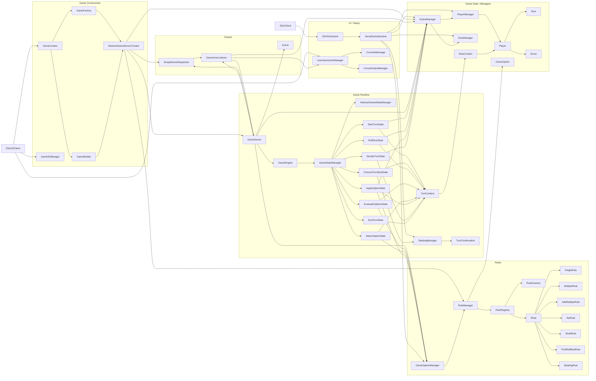
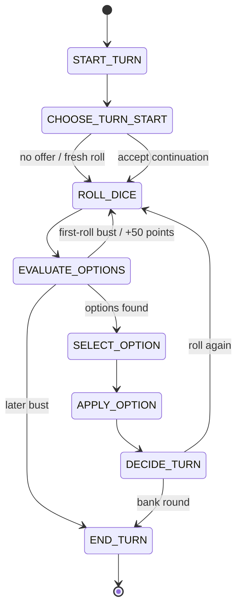

# Zilch Basic

LibGDX desktop Zilch implementation built around:

- dynamic rule discovery
- an explicit turn state machine
- a simple in-process event system
- creator/builder/factory wiring for bootstrapping a game
- a visual, event-loop friendly play surface backed by the same core rules

The current `main` path launches the LibGDX visual game. The previous console
menu path is preserved as `client.ZilchCliClient` and on the `cli-menu` branch.

## Running

```bash
./gradlew run
```

To run the preserved console flow from this branch:

```bash
./gradlew run --args='cli'
```

To run tests:

```bash
./gradlew test
```

## Setup and Variants

The winning score and opening ("on") score are configured separately. The
opening score defaults to 1,000, but it can be changed before starting a game.

`Stealing` is an optional, dynamically discovered variant. When a player banks
without using all six dice, the next player may either:

- continue with the remaining dice and put the prior turn's round score at risk, or
- decline and start fresh with all six dice.

A successful continuation can be banked and offered to the following player,
so stealing can chain. A bust, a fresh-roll decision, or finishing the dice set
ends the current chain. A player may only steal after already banking the
configured opening score; inherited points can never put a player "on."
The prior player's banked points remain safe; the continuing player begins a
separate at-risk round at the inherited score.

## IntelliJ Setup

Open the folder as a Gradle project and reload Gradle after checkout. Do not
copy the `gradle/` wrapper folder into `lib/`; `gradle/` is build tooling, while
dependencies are resolved from `build.gradle`.

Expected directory markings:

- `src/main`: Sources Root
- `src/test`: Test Sources Root
- `build`, `out`, `.gradle`: Excluded
- `lib`: regular folder for legacy local jars, not a Resources Root

Naming convention:

- Display/project name: `Zilch Basic`
- Gradle root project name: `Zilch Basic`
- Application/archive/script name: `zilch-basic`

## Architecture Map

The diagram below shows how the main classes connect at runtime.



## Turn State Machine

This is the per-turn flow driven by `GameStateManager`.



## Key Notes

- `ZilchClient` now starts the LibGDX desktop interface. `ZilchCliClient` keeps the older interactive console menu available.
- `VisualGameSession` adapts the existing game rules to button-driven UI actions without blocking the LibGDX render loop.
- `RuleScanner` discovers concrete rule classes under `rules.variable`, so a new rule that implements the expected template can be loaded automatically.
- `RuleRegistry` separates discovered rules from active rules, and `UserInteractionManager` uses that discovered list to build setup options.
- Some setup options are game variants rather than scoring options, such as `First-Roll Bust`, which can award 50 points and reroll on a no-score opening roll.
- `Stealing` is also a non-scoring setup variant. `StealingManager` owns its one-use cross-player continuation, while `ChooseTurnStartState` makes the accept-or-fresh decision explicit in the state machine.
- The opening score is a game setting rather than a hardcoded gameplay rule, and stealing eligibility uses that configured value.
- `TurnContext` is the mutable turn-local object passed across the entire state machine.
- `GameServer` owns the outer game loop, while `GameEngine` owns a single turn.
- `GameOverListener` bridges the event system back into gameplay by triggering the final-round flow.

## TODO

- Add more specialized listeners if more game events become meaningful.
- Continue cleanup and documentation polishing.
