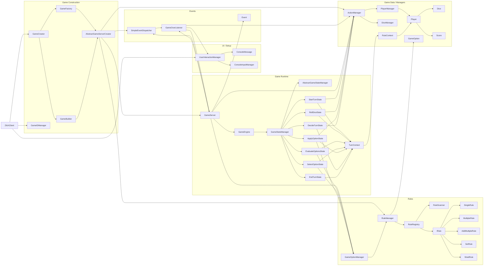
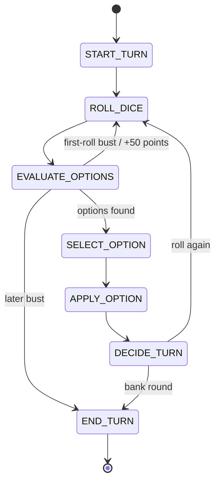

# Zilch Basic

Text-based Zilch implementation built around:

- dynamic rule discovery
- an explicit turn state machine
- a simple in-process event system
- creator/builder/factory wiring for bootstrapping a game

## Architecture Map

The diagram below shows how the main classes connect at runtime.

## Turn State Machine

This is the per-turn flow driven by `GameStateManager`.

## Key Notes

- `RuleScanner` discovers concrete rule classes under `rules.variable`, so a new rule that implements the expected template can be loaded automatically.
- `RuleRegistry` separates discovered rules from active rules, and `UserInteractionManager` uses that discovered list to build setup options.
- Some setup options are game variants rather than scoring options, such as `First-Roll Bust`, which can award 50 points and reroll on a no-score opening roll.
- `TurnContext` is the mutable turn-local object passed across the entire state machine.
- `GameServer` owns the outer game loop, while `GameEngine` owns a single turn.
- `GameOverListener` bridges the event system back into gameplay by triggering the final-round flow.

## TODO

- Add more specialized listeners if more game events become meaningful.
- Add packaging / build tooling so tests can run without a custom launcher.
- Continue cleanup and documentation polishing.
