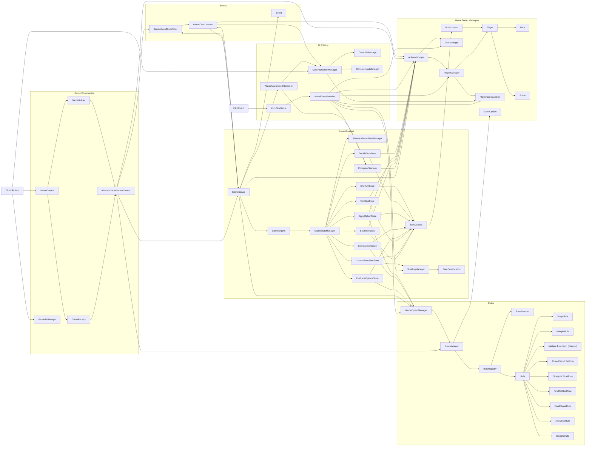
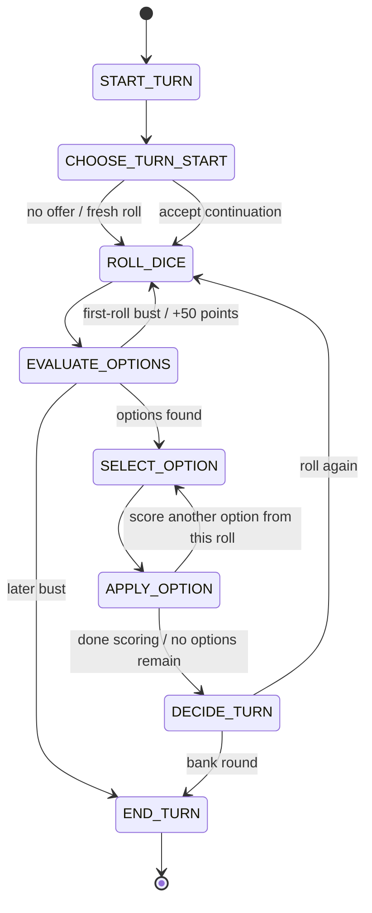

# Zilch Basic

LibGDX desktop Zilch implementation built around:

- dynamic rule discovery
- an explicit turn state machine
- a simple in-process event system
- creator/builder/factory wiring for bootstrapping a game
- a visual, event-loop friendly play surface backed by the same core rules
- optional Easy, Medium, and Hard computer players shared by both interfaces

The current `main` path launches the LibGDX visual game. The previous console
menu path is preserved as `client.ZilchCliClient` and on the `cli-menu` branch.

## Shared Zilch Baseline

This project follows the same gameplay and setup contract as the companion
Zilch projects while retaining its Java and LibGDX architecture.

| Setting | Default | Behavior |
| --- | ---: | --- |
| Players | 2 humans | Local pass-and-play or computer play, with 1 to 6 players supported |
| Winning score | 5,000 | Reaching or passing this score ends the normal game |
| Opening score | 1,000 | An unopened player must reach this amount in one round before banking |
| Core scoring | On | Singles, Multiples with later-roll extensions, Three Pairs, and Straight |
| First-Roll Bust | On, 50 points | A no-score first roll awards 50 and rerolls |
| Final Chase | On | Every other player receives one final turn |
| Allow Ties | On | All players tied at the final high score share the result |
| Stealing | Off | An eligible opened player may continue a banked partial turn |

Players may apply more than one non-overlapping scoring option from the same
physical roll. For example, a single 1 and a single 5 can both be scored for
150 points before the player decides whether to roll again or bank.

## Running

```bash
./gradlew run
```

To run the preserved console flow from this branch:

```bash
./gradlew run --args='cli'
```

That setup writes `config.properties`. Reuse the saved player types,
difficulties, and score settings with `./gradlew run --args='cli readConfig'`.

To run tests:

```bash
./gradlew test
```

## Computer Players

The visual setup can make Player 2 a computer opponent and select Easy,
Medium, or Hard. The console setup can mark any named player as a computer, so
human-only pass-and-play, mixed tables, and computer-only tables use the same
state machine. Medium is the default when an older or incomplete computer
configuration has no valid difficulty.

| Level | Decision style |
| --- | --- |
| Easy | Takes every compatible scoring option, normally banks at 600 round points, and banks immediately when that wins |
| Medium | Values points, remaining dice, hot dice, and multiples; adjusts risk for the score gap and can stage below or press beyond the target |
| Hard | Uses the best simulation-tested standard policy, or the separately trained Stealing policy when that variant is active, plus the same score-aware finish logic |

The Medium base banking cutoffs for one through six dice remaining are 350,
500, 700, 850, 1,000, and 1,150 points. Hard uses 200, 1,021, 1,128,
1,506, 2,130, and 2,130 in standard play. With Stealing enabled, Hard switches
to 313, 313, 1,106, 1,360, 1,360, and 1,376 and also evaluates whether a
carried score is worth accepting. Its practical Stealing acceptance cutoffs
are about 550, 450, 350, 250, and 150 carried points for one through five dice.

These Hard policies are the best tested in the companion two-player simulator,
not mathematically proven optimal. The holdouts used a 5,000-point target,
1,000-point opening requirement, and the default scoring profile. The standard
policy scored 58.5621% match points against the baseline over 500,000 games,
and the Stealing policy scored 52.0527% in its matching holdout. Separate Three
Pairs-off runs support the same recommendation for that toggle. They do not
establish the policy for disabling Straights, Multiples, or Singles.

## Setup and Variants

The Winning Score and Opening Score are configured separately. Visual
setup starts from the defaults above. In console setup, pressing Enter at a
rule prompt accepts that rule's displayed default.

`Multiple Extension` is an internal companion to `Multiples`, not a separate
setup option. Enabling Multiples automatically enables extensions when a later
roll adds matching dice to a multiple already scored in the current turn.

`Final Chase` and `Allow Ties` are independent options. With Final Chase off,
the game ends as soon as a player reaches the target. With Allow Ties off, the
first player to attain the final high score remains the winner when another
player later matches it.

`Stealing` is an optional, dynamically discovered variant. When a player banks
without using all six dice, the next player may either:

- continue with the remaining dice and put the prior turn's round score at risk, or
- decline and start fresh with all six dice.

A successful continuation can be banked and offered to the following player,
so stealing can chain. A bust, a fresh-roll decision, or finishing the dice set
ends the current chain. A player may only steal after already banking the
configured opening score; inherited points can never put a player "on."
The prior player's banked points remain safe; the continuing player begins a
separate at-risk round at the inherited score.

## Intentional Java Differences

- The primary interface is a resizable LibGDX desktop application. The console
  interface remains available for text play and scripting.
- Rules are discovered from Java classes at runtime, including from packaged
  JARs. Other Zilch projects may use static registries appropriate to their
  language.
- The console uses an explicit turn state machine and event dispatcher. The
  visual session exposes non-blocking button actions for the LibGDX event loop.
- Console setup persists player names, human or computer type, computer
  difficulty, and score thresholds in `config.properties`. Existing files
  without player metadata load as human-only games. Full game save/resume and
  visual setup persistence are not currently offered.

## IntelliJ Setup

Open the folder as a Gradle project and reload Gradle after checkout. Do not
copy the `gradle/` wrapper folder into `lib/`; `gradle/` is build tooling, while
dependencies are resolved from `build.gradle`.

Expected directory markings:

- `src/main`: Sources Root
- `src/test`: Test Sources Root
- `build`, `out`, `.gradle`: Excluded
- `lib`: regular folder for legacy local jars, not a Resources Root

Naming convention:

- Display/project name: `Zilch Basic`
- Gradle root project name: `Zilch Basic`
- Application/archive/script name: `zilch-basic`

## Architecture Map

The diagram below shows how the main classes connect at runtime.



## Turn State Machine

This is the per-turn flow driven by `GameStateManager`.



## Key Notes

- `ZilchClient` now starts the LibGDX desktop interface. `ZilchCliClient` keeps the older interactive console menu available.
- `VisualGameSession` adapts the existing game rules to button-driven UI actions without blocking the LibGDX render loop.
- `ComputerStrategy` owns all automated scoring, banking, finishing, and Stealing decisions. The console routes computer turns through `PlayerAwareUserInteraction`, while `VisualGameSession` advances the same strategy one delayed action at a time.
- `RuleScanner` discovers concrete rule classes under `rules.variable`, so a new rule that implements the expected template can be loaded automatically.
- `RuleRegistry` separates discovered rules from active rules, and `UserInteractionManager` uses that discovered list to build setup options.
- Some setup options are game variants rather than scoring options, including `First-Roll Bust`, `Final Chase`, `Allow Ties`, and `Stealing`.
- Default-enabled metadata is separate from a rule's configuration value, so Stealing can use `true` when selected while remaining off in a fresh setup.
- `Multiples` automatically activates its hidden `Multiple Extension` companion rule.
- `Stealing` is also a non-scoring setup variant. `StealingManager` owns its one-use cross-player continuation, while `ChooseTurnStartState` makes the accept-or-fresh decision explicit in the state machine.
- The opening score is a game setting rather than a hardcoded gameplay rule, and stealing eligibility uses that configured value.
- `TurnContext` is the mutable turn-local object passed across the entire state machine.
- `GameServer` owns the outer game loop, while `GameEngine` owns a single turn.
- `GameOverListener` bridges the event system back into gameplay by applying Final Chase and tie policy to the console flow.

## TODO

- Add more specialized listeners if more game events become meaningful.
- Consolidate the console and visual orchestration behind one shared session reducer if their implementation paths grow further.
